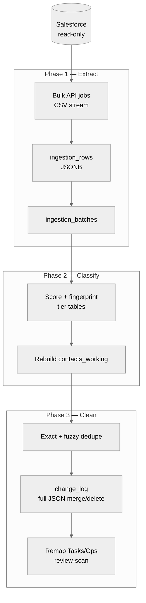
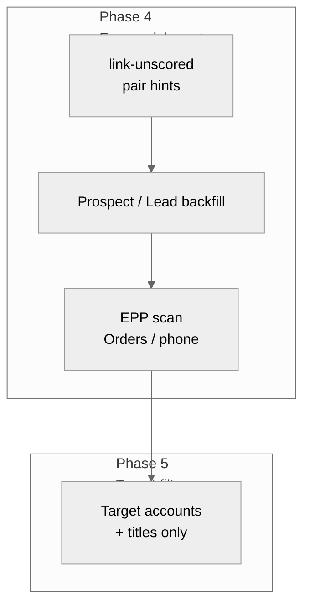
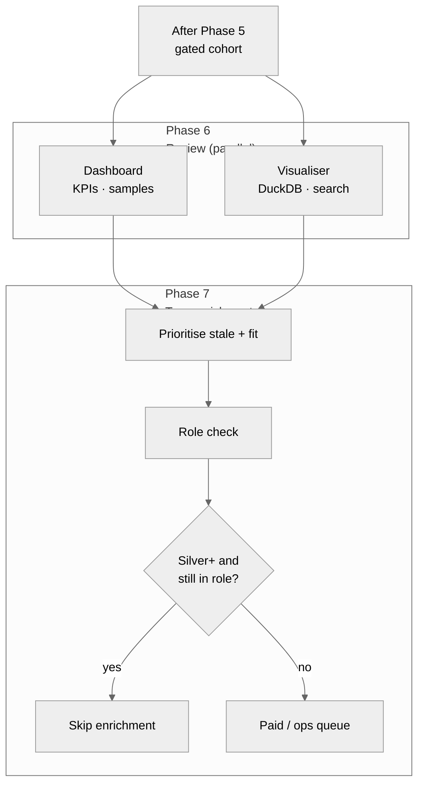
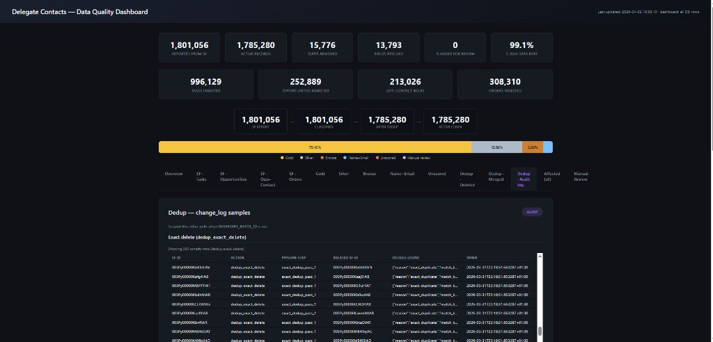
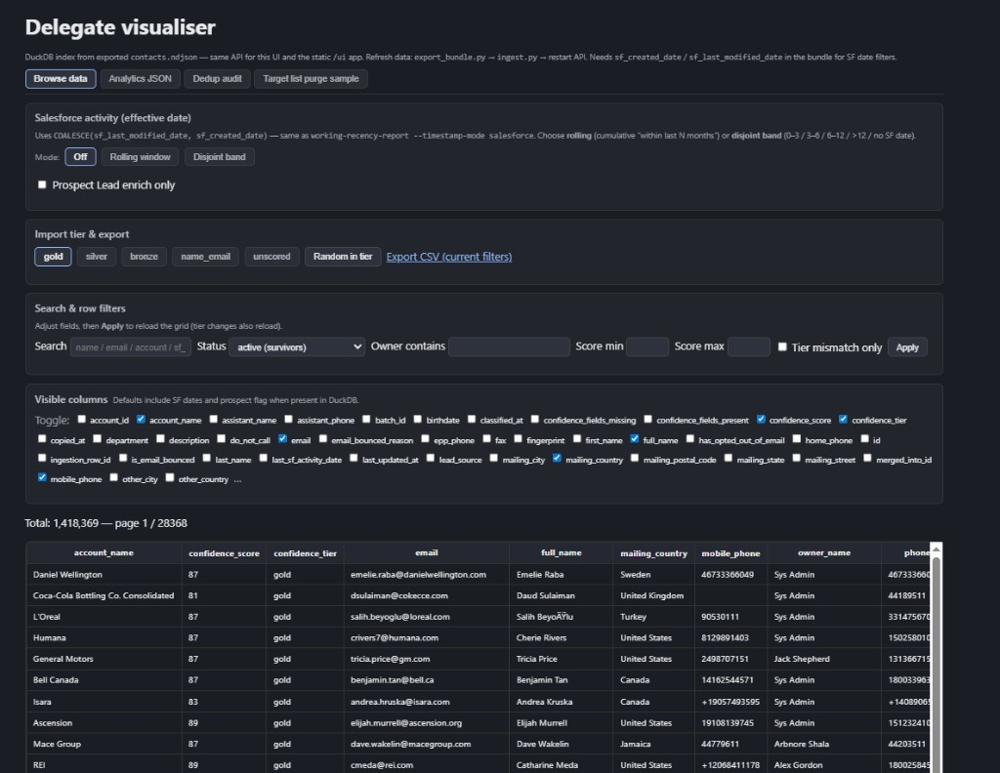

# Delegate Data Ingestion — End-to-End Flow

**Purpose:** How delegate contact data moves from Salesforce into a clean, enriched, analysis-ready state, and how we review it before final enrichment.

---

## What this system does

We take raw delegate contact data from Salesforce — including related records such as tasks, opportunities, and orders — and run it through an automated pipeline that classifies, cleans, deduplicates, **free-enriches**, **target-filters**, and surfaces data in dashboards and the **Delegate visualiser**. A final **true enrichment** phase prioritises contacts using dashboard signals, recency, and target-list fit.

---

## Classification groupings (active contacts)

Quality tiers summarise how complete and reliable each contact is. Typical **active** distribution (illustrative — use live dashboard counts for current numbers):

| Tier | Typical count | Role |
|------|---------------:|------|
| **Gold** | 1,418,369 | Strong profiles — full identity and reachability |
| **Silver** | 229,621 | Strong with minor gaps |
| **Bronze** | 93,972 | Basic info; several fields missing — **weak band** |
| **Name + Email** | 42,746 | Minimal but often contactable — **weak band** |
| **Unscored** | 572 | Insufficient structured data — **weak band**; includes effectively **uncontactable** stubs |
| **Total active** | **1,785,280** | *1,418,369 + 229,621 + 93,972 + 42,746 + 572* |

**Weak data (only Bronze, Name+Email, and Unscored):** these bands carry the highest risk of incomplete or stale identity. Within **Unscored**, the smallest slice (e.g. **572** records, **~0.03%** of the active total above) is effectively **uncontactable** — fragmented or empty records where there is no reliable way to reach the person.

**Heuristic for junk / duplicate stubs:** we look for **empty or fragmented** rows (e.g. random-looking email with almost no other fields). If a record was **created seconds before or after** another on the same pattern and the **lead name matches the email local-part**, we can **reasonably treat it as a duplicate**, **merge** it, and **backfill** empty fields from the survivor. This is part of cleaning and fuzzy matching, not a substitute for formal dedupe rules.

---

## End-to-end flow (detailed Mermaid)

The walkthrough is split into **three charts** (PDF-friendly; one giant chart + dark `style()` fills caused blank/black pages in browser print-to-PDF). Read **Chart 1 → 2 → 3**. CLI names mirror `docs/FEATURE_MAP_AND_PIPELINE.md`.

### Chart 1 — Extract, classify, clean



### Chart 2 — Free enrichment → target gate



### Chart 3 — Review surfaces → true enrichment



**How to read:** after **target filtering**, the **dashboard** and **visualiser** paths run **in parallel**; both inform **true enrichment** (same prioritisation rules: cohort after the gate, recency, role, tier).

---

## Step-by-step breakdown

### 1. Extract — Salesforce to database

Pull **every field** from Salesforce for all relevant objects:

| Object | Why we need it |
|--------|----------------|
| **Contacts** | Core delegate records |
| **Leads** | Used later to enrich contacts with missing data |
| **Accounts** | Company / organisation mapping |
| **Campaigns & members** | Event attendance and marketing touchpoints |
| **Events** | Meeting and activity history |
| **Tasks** | Call logs, follow-ups, action items |
| **Opportunities** | Commercial engagement and pipeline status |
| **Orders** | EPP forms and booking data |

All records land in staging as **raw JSON**, preserving Salesforce exactly as exported.

---

### 2. Classify — score and tier

Every contact is scored and assigned a **confidence tier** (Gold, Silver, Bronze, Name+Email, Unscored). See the **classification groupings** table above for how to read the bands.

All tiers are combined into a single **working copy** (`contacts_working`) — the table the rest of the pipeline uses.

---

### 3. Clean — deduplicate, merge, and review

**Dedup** runs in two passes: **exact** (same key fields) and **fuzzy** (same person, divergent details). **Manual review** queues junk patterns (placeholder emails, nonsense phones, etc.).

**Auditability — no silent loss:** for **every merge or delete**, we **log the full record payload in JSON** (and related audit metadata). **Merged or deleted rows are never thrown away without a recoverable trail** — data is **always recoverable** from the audit and staging history.

Child references (tasks, opportunities, etc.) are remapped or flagged per pipeline rules so operational history stays attached to survivors where possible.

---

### 4. Free enrichment — three passes (no extra cost)

Three **free** enrichment passes run in sequence (configurable in tooling):

1. **Fuzzy batch match** — near-duplicate rows (including **seconds-apart** creates with overlapping identity); merge to **fix** and **fill** empty fields.
2. **Prospect / Lead enrichment** — match Leads to Contacts and backfill fields (preview before apply).
3. **EPP / Order signals** — e.g. scan Orders for attached EPP forms and propagate phone or related fields to Contacts via known linkage fields.

These passes are **not** billed as premium enrichment; they are part of the baseline hygiene layer.

---

### 5. Target list filtering

After free enrichment, we **filter the cohort** to **target accounts and titles** so that **only delegates who match the programme spec** continue in the flow. This is a **gate**: downstream dashboards and **true enrichment** focus on the right universe, not the entire database.

---

### 6. Dashboard & Delegate visualiser — review surfaces

**Data Quality Dashboard** (static HTML + `examples.json` from Postgres):

- **Tier and pipeline metrics** — exported vs active, dedupe removed, fields rescued, optional SF object ingestion counts (Tasks, Opportunities, Orders, etc.).
- **Example records everywhere** — random samples per tier, dedupe tabs (**deleted**, **merged**, **audit log**), manual review — so reviewers can **scroll real rows**, not just aggregates.
- **Always-on samples** — deleted and merged contacts remain **viewable** in tabbed samples with full audit context.



**Delegate visualiser** (DuckDB index over exported bundles, local API):

- **Split view** to **match and compare** groups or records side by side.
- **Search across Salesforce-mapped fields** on **current, deleted, and merged** rows (as exported into the bundle).
- Tabs such as **Browse data**, **Analytics JSON**, **Dedup audit**, **Target list purge sample** — deep inspection beyond the summary dashboard.



*Screenshots are representative; install paths: see `dashboard/README.md` and `scripts/review_ui_export.ps1` / `scripts/Export & Classify.md`.*

**At this step, the “groupings” in play** are exactly the **classification tiers** (and dedupe outcomes) **after** target filtering — the dashboard **counts table** should be read as the **official split** of the cohort under review.

---

### 7. True enrichment — prioritised, role-aware

**True enrichment** is the **final** commercial enrichment wave. We use **dashboards + exported data** to choose **who still needs enrichment**.

**Signals:**

- **Stale contact** — e.g. last meaningful contact **over ~10 months ago** (threshold configurable).
- **Target list fit** — must align with **delegate spec** after filtering.

**Role check:**

- If the contact is **still in the expected role** (per available data) **and** the tier is **Silver or better**, we **typically do not need** further enrichment — the record is already strong and current enough.

**Outcome:** remaining contacts enter **paid / operational enrichment** workflows; specifics are owned by the enrichment runbook.

---

### Recency bands (supporting assessment)

Contacts can also be bucketed by **how recently** we interacted (e.g. 3 / 6 / 12+ months). This supports **true enrichment** prioritisation and reporting; it is aligned with the “stale” signal above.

---

## Key safeguards

| Safeguard | What it means |
|-----------|----------------|
| **Salesforce is read-only** | We do not write back to Salesforce; exports are read-only. |
| **Dry-run before apply** | Mutable stages support `--dry-run` or preview before apply. |
| **Full audit trail** | Merges, deletes, and enrichments are logged with **before/after** and **full JSON** payloads where applicable. |
| **No unrecoverable deletes** | **Any merged or deleted record remains logged with full fields in JSON** — data is **never** silently discarded. |
| **Single working copy** | Tier snapshots and working rows are managed so downstream steps share one consistent dataset. |

---

## Data flow summary

```
Salesforce (source)
       │
       ▼
[ Raw staging — all fields, all objects ]
       │
       ▼
[ Classify → working copy ]
       │
       ▼
[ Clean & dedupe — full JSON audit for merge/delete ]
       │
       ▼
[ Free enrichment — 3 passes ]
       │
       ▼
[ Target list filtering — spec-aligned cohort ]
       │
       ▼
[ Dashboard + Delegate visualiser — review & compare ]
       │
       ▼
[ True enrichment — recency, targets, role check, Silver+ skip ]
```

---

## Generating the final PDF (full readability)

**This standalone folder** (`E2E Spec/`) mirrors the main repo docs: use **`index.html`** for print/PDF (same content as `docs/DELEGATE_DATA_INGESTION_E2E_print.html` in the full project).

**Deliverable file (what you share or archive):**

| | |
|---|---|
| **In the full Data Foundation repo** | **`docs/DELEGATE_DATA_INGESTION_E2E.pdf`** (from `scripts/export_e2e_pdf.ps1` or browser print) |
| **Source for print (this folder)** | **`index.html`** (dark theme, Mermaid, screenshots, print CSS) |
| **Authoritative text** | **`DELEGATE_DATA_INGESTION_E2E.md`** (this file; use for GitHub and diffs) |

**Best quality (recommended):** open **`index.html`** in **Chrome** or **Edge** → **Ctrl+P** → **Save as PDF** → in **More settings** turn **Background graphics** **On** (required for diagram colours and screenshot fidelity). Use **A4** or **Letter** margins as needed; scale **100%**.

The print **HTML** uses **A4 `@page` margins** and avoids **`break-inside: avoid`** on huge blocks (that pattern was causing **blank pages**). Prefer **Chrome or Edge** for PDF export; **print preview** should show continuous pages with no large gaps.

**Automated PDF in the full repo only:** from the Data Foundation repo root run `powershell -File scripts\export_e2e_pdf.ps1` (writes `docs/DELEGATE_DATA_INGESTION_E2E.pdf`). If Mermaid appears blank in headless export, use **browser Save as PDF** on **`index.html`** so diagrams finish rendering before print.

---

---

*Production pipeline description. Last updated April 2026.*
